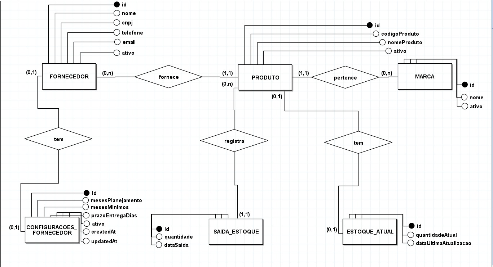

# Sistema de Gestão de Estoque

## O que é?

Sistema para controlar estoque de produtos. Ajuda a saber quando precisa comprar mais produtos.

## Integrantes do Grupo

- **RM 560812** - Gabriel Dos Santos Souza - Responsável por NoSQL e IOT
- **RM 560649** - Thomas Henrique Baute - Responsável por .NET, QA e DevOPS
- **RM 559999** - Bruno Mateus Tizer das Chagas - Responsável por Mobile e JAVA

## Como rodar?

1. Abrir o projeto no IntelliJ
2. Rodar a classe `GestaoEstoqueApplication.java`
3. A aplicação vai subir na porta `http://localhost:8082`

## Como acessar o banco H2?

- Acessar: `http://localhost:8082/h2-console`
- JDBC URL: `jdbc:h2:mem:gestao-estoque-db`
- Usuario: `sa`
- Senha: (deixar em branco)

## Entidades do Sistema

### Fornecedor
- id: String
- nome: String
- cnpj: String
- telefone: String
- email: String
- ativo: Boolean

### Produto
- id: String
- codigoProduto: String
- nomeProduto: String
- ativo: Boolean

### Marca
- id: String
- nome: String
- ativo: Boolean

### Estoque Atual
- id: String
- quantidadeAtual: Integer
- dataUltimaAtualizacao: Date

### Saida Estoque
- id: String
- quantidade: Integer
- dataSaida: Date

### Configuracoes Fornecedor
- id: String
- mesesPlanejamento: Integer
- mesesMinimos: Integer
- prazoEntregaDias: Integer
- ativo: Boolean
- createdAt: Date
- updatedAt: Date

## Relacionamentos

- Produto tem Fornecedor (muitos pra um)
- Produto tem Marca (muitos pra um)
- SaidaEstoque tem Produto (muitos pra um)
- EstoqueAtual tem Produto (um pra um)
- ConfiguracoesFornecedor tem Fornecedor (um pra um)

## Documentação da API

A documentação completa da API está disponível via Swagger:
- Acessar: `http://localhost:8082/swagger-ui.html`
E o arquivo collection do Postman está todo em JSON na raiz do projeto

## Testes da API

Para testar os endpoints, importe a collection do Postman:
- Arquivo: `Gestao-Estoque-API.postman_collection.json`

## Modelo DER

## Vídeo Pitch
https://www.loom.com/share/a613b40c79c244608f3542cf14f4f79c?sid=b49be580-427a-4031-99c3-a9c4e66bacb0

## Vídeo de Funcionalidades
https://app.guidde.com/share/playbooks/5QVsBRgF2wLtsgB5oGVJ3e?origin=FpQpm0BK0JcIFJS3zfGOLS7I1eG2